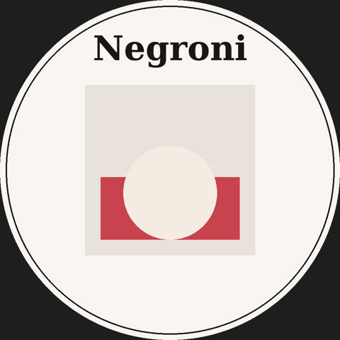

# negroni-round

A Wi-Fi captive portal for ESP32 that serves a Negroni cocktail poster, plus a matching poster drawn on a round LCD.

- Open Wi-Fi access point called `Negroni` (change `ssid` in `src/main.cpp`)
- DNS catch-all and web server redirect every request to the poster page at `192.168.4.1`
- Round-screen poster: "Negroni" title with a centred red-and-cream illustration

## Hardware

Written for the **Guition ESP32-C3, 1.28". 

The original `esp32dev` environment still builds the portal alone for any ESP32 without a screen.

## Build and flash

With PlatformIO on a computer:

    pio run -e guition_round --target upload

If upload fails, hold BOOT while plugging in USB.

### Without a computer

Pushing to GitHub runs `.github/workflows/build.yml`, which builds the firmware and publishes `negroni-guition-round.bin` as a downloadable artifact on the **Actions** tab. It is a merged image to be flashed at address `0x0`.

## Layout

| File | Purpose |
|------|---------|
| `src/main.cpp` | Captive portal and poster web page |
| `src/display.cpp` | Draws the poster on the round screen (LovyanGFX) |
| `src/board_config.h` | Display pins and size |
| `platformio.ini` | Build environments |

## Credits and license

Derived from [ZelkaT/negroni](https://github.com/ZelkaT/negroni) and released under the same GPL-3.0 license (see `LICENSE`).
